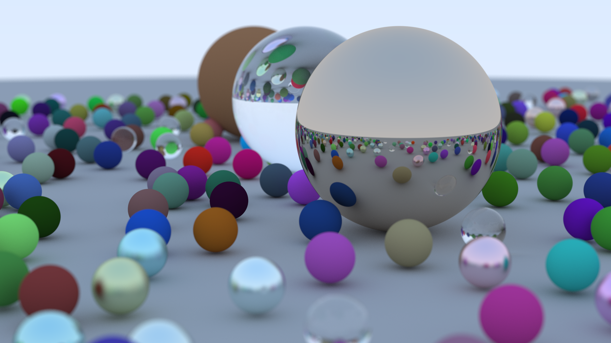

# Ray Tracing in One Weekend - Multithreaded



> _Исходный код изначально был взят из книги:_
[_Ray Tracing in One Weekend_](https://raytracing.github.io/books/RayTracingInOneWeekend.html)

## Отличия:
* Многопоточная обработка изображения и индикатор прогресса
* Функции разделены на объявление в `.hpp` и определение в `.cpp` файлах
* Большая часть кода из `main.cpp` абстрагирована в отдельный класс

## Загрузка:
```sh
git clone https://github.com/Valetoriy/RTiOW-multithreaded
```

## Сборка и запуск:
```sh
./build.sh && ./rays > image.ppm
```

## Конфигурация:
Изменение соотношения сторон, ширины изображения (высота вычисляется автоматически),
количества лучей на пиксель и максимального числа отражений производится путём прямого
редактирования исходного кода в `main.cpp`.

По умолчанию: `16 / 9, 400, 50, 50`.

## Замечания:
При сборке с `thread-sanitizer` показываются предупреждения о небезопасном доступе
нескольких потоков к функции `random_double()`. Из-за гонки данных многие программы могут
давать результаты, отличные от ожидаемых, но в данном случае это ни на что не влияет.

Решением этой "проблемы" была бы замена `random_double()` на детерминестичный алгоритм
вычисления координат `u` и `v` лучей. Однако даже в книге автор ссылается на то, что
выглядеть он будет "не очень красиво".
> +мне лень
